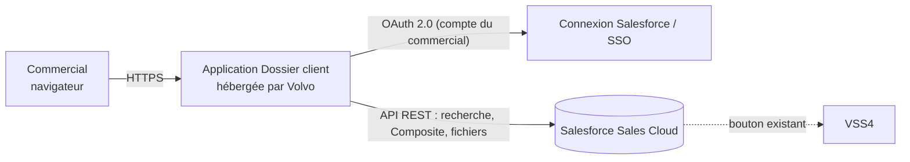

# Proposition — Simplifier la création des dossiers clients dans Salesforce

**Statut :** proposition à valider · **Périmètre :** 7 commerciaux et leurs 2 responsables · **Porteur :** BA / CRM Salesforce

---

## 1. Le problème observé

Après l'accord du responsable, le commercial constitue le dossier client dans Sales Cloud à partir des pièces reçues sur WhatsApp (RC, parfois bilan, parfois seulement l'identifiant fiscal). D'après le parcours décrit par un commercial, cela lui prend **au moins 30 minutes par dossier dans le meilleur des cas**, souvent davantage à cause des appels qui l'interrompent.

Ce temps vient surtout :
- de la **recopie manuelle** des informations des PDF dans le formulaire du compte, avec double vérification ;
- de la **navigation entre plusieurs écrans** : compte → segmentation → contact → pièces jointes → opportunité → rattachement du contact ;
- des **allers-retours** entre WhatsApp, les PDF et Salesforce ;
- de la **reprise difficile** après une interruption.

> Ce constat repose sur l'échange avec un commercial. Il doit être confirmé auprès des six autres et mesuré (voir § 8).

## 2. La solution proposée (lot 1)

Une application web interne, **« Dossier client »**, qui regroupe la création du dossier en un seul parcours guidé en 3 étapes et crée les fiches dans Salesforce en une fois.

| Étape du parcours actuel | Aujourd'hui | Avec l'application |
|---|---|---|
| 1. Réception RC / IF / coordonnées | WhatsApp → PC | Inchangé (hors périmètre du lot 1) |
| 2. Saisie du nouveau compte | Recopie champ par champ depuis le PDF | Dépôt du PDF → valeurs **proposées avec leur source** → vérification |
| — | Pas de contrôle de doublon guidé | Recherche automatique : même RC, même ICE, nom proche |
| 3. Segmentation puis contact | 2 écrans séparés, recherche d'infos dans WhatsApp | Même parcours ; téléphone et e-mail repérés en collant le message WhatsApp |
| 4. Pièce jointe RC | Onglet « Notes & pièces jointes », dépôt manuel | Jointe **automatiquement** au compte |
| 5. Opportunité + rattachement du contact | Création puis rattachement manuel | Créés **automatiquement**, contact principal rattaché |
| 6. Devis VSS | Bouton « Créer/afficher un devis VSS » | **Inchangé** : le commercial ouvre l'opportunité et clique |
| 7 à 10. Chatter, Excel « Demande d'affectation », Outlook | Copier-coller, captures d'écran | Hors lot 1 → lot 3 (§ 9) |

**Ce que le commercial fait encore lui-même, volontairement :** vérifier les valeurs proposées, confirmer qu'il ne s'agit pas d'un client existant, choisir la personne à contacter (le gérant du RC n'est pas forcément l'interlocuteur), décrire le besoin. L'application **ne crée rien sans sa validation**.

## 3. Garanties de fonctionnement

| Situation | Comportement |
|---|---|
| Appel pendant la saisie | Enregistrement automatique ; **« Enregistrer et quitter »** puis **« Reprendre »** depuis la liste des dossiers en cours |
| Une fiche est refusée par Salesforce (doublon, règle de validation, champ manquant) | **Rien n'est créé** (requête « tout ou rien ») ; message clair ; le dossier reste modifiable |
| Coupure réseau pendant la création | Le dossier passe « à vérifier » ; au nouvel essai, l'application **recherche d'abord** si le compte a été créé, pour éviter un doublon |
| Double clic sur « Créer » | Une seule création |
| Échec de l'envoi d'une pièce jointe | Les fiches restent créées ; bouton **« Réessayer l'envoi des pièces »** |
| PDF dont le texte est mal encodé (caractères bizarres) | Valeurs détectées et **jamais proposées** ; relues par OCR si Tesseract est installé, sinon champ vide « illisible, à saisir » |
| Document scanné (image) | Lu par OCR si disponible, sinon saisie manuelle |
| Adresse | Découpée en rue / code postal / ville ; pays toujours Maroc ; **code postal vérifié** avec le référentiel Barid Al-Maghrib |
| RC et document fiscal ne concordent pas | Alerte affichée avant de continuer |
| Valeur déjà corrigée par le commercial | **Jamais écrasée** par une lecture de document |

## 4. Architecture

- **Connexion avec le compte Salesforce du commercial** (OAuth 2.0, flux « web server » + PKCE) : l'application ne voit jamais son mot de passe ; les fiches sont créées **à son nom, avec ses droits**, et les règles de validation et de doublons de l'org s'appliquent normalement.
- **Création « tout ou rien »** via l'API Composite de Salesforce (`allOrNone`) : compte, segmentation, contact, opportunité et rôle du contact sont créés ensemble ou pas du tout.
- **Pièces jointes** : envoyées comme fichiers Salesforce (ContentVersion) rattachés au compte.
- **Correspondance des champs** paramétrable dans un fichier (`config/field_mapping.json`) : adapter l'application aux noms réels des champs Volvo ne demande pas de développement.
- **Auto-contrôle** : une page technique vérifie que chaque champ configuré existe dans Salesforce et signale les champs obligatoires oubliés.

## 5. Sécurité et données personnelles

- Accès réservé aux utilisateurs Salesforce autorisés ; chaque utilisateur ne voit que ses propres dossiers en cours.
- Jetons Salesforce conservés **côté serveur** uniquement ; cookie de session signé, `HttpOnly`, `Secure` en production ; protection contre les requêtes intersites.
- Les PDF sont conservés **uniquement le temps de la préparation**, puis supprimés de l'application dès leur envoi dans Salesforce ; les brouillons abandonnés sont purgés après 14 jours (paramétrable).
- Requêtes vers Salesforce échappées (pas d'injection SOQL) ; fichiers limités à 8 Mo / 40 pages et contrôlés (PDF uniquement).
- **À valider avec le DPO / juridique Volvo** : la base légale et la durée de conservation des données des contacts (numéros WhatsApp, e-mails). Je pense que le cadre applicable au Maroc est la loi 09-08 et la CNDP, mais ce point doit être confirmé par un juriste.
- **À valider avec la sécurité IT** : hébergement, reverse proxy, journalisation, revue de code.

## 6. Ce que Volvo doit fournir

| Besoin | Qui | Pourquoi |
|---|---|---|
| Une **sandbox** Salesforce avec des données de test | Admin Salesforce | Tester sans risque pour la production |
| Une **application connectée** OAuth (Connected App ou External Client App ; le type à privilégier est à confirmer avec l'admin) avec URL de rappel et PKCE | Admin Salesforce | Permettre la connexion des commerciaux |
| Les **noms d'API réels** des champs : RC, ICE, IF, forme juridique, objet et champs de segmentation, étape d'opportunité par défaut, rôle du contact | Admin Salesforce + responsables commerciaux | Compléter `config/field_mapping.json` |
| Un **échantillon anonymisé** de RC et de documents fiscaux (10 à 20) | Commerciaux | Calibrer la lecture automatique |
| Le **référentiel des codes postaux** Barid Al-Maghrib (data.gov.ma) | BA / CRM | Vérifier ville et code postal |
| **Tesseract** (OCR) sur le serveur | IT / infrastructure | Lire les PDF scannés ou mal encodés |
| Un **hébergement** interne (conteneur Docker, HTTPS, un volume de stockage) | IT / infrastructure | Mise à disposition |
| Validation **sécurité et données personnelles** | Sécurité IT, DPO | Conformité |

## 7. Profils nécessaires

| Profil | Rôle | Charge indicative (à confirmer) |
|---|---|---|
| **BA / CRM Salesforce** (porteur) | Recueil, règles métier, correspondance des champs, tests utilisateurs, formation, conduite du changement | Tout le projet |
| **Admin Salesforce** (interne ou prestataire) | Application connectée, sandbox, contrôle des champs, règles de doublons | Ponctuel |
| **Développeur Python / web** | Reprise du code, calibration de la lecture PDF, industrialisation, maintenance | Principal pendant le lot 1 |
| **IT / infrastructure** | Hébergement, HTTPS, sauvegardes, supervision | Ponctuel |
| **Sécurité / DPO** | Validation | Ponctuel |
| **2 commerciaux pilotes + 1 responsable** | Tests en conditions réelles, retours | Quelques heures par semaine pendant le pilote |

## 8. Déploiement et mesure

| Phase | Contenu | Critère pour passer à la suite |
|---|---|---|
| 0. Validation | Présentation de la démonstration aux responsables et à l'IT | Accord sur le périmètre et l'hébergement |
| 1. Paramétrage | Sandbox, application connectée, correspondance des champs, calibration PDF | Auto-contrôle au vert ; lecture correcte sur l'échantillon |
| 2. Pilote | 2 commerciaux, dossiers réels, en production après validation | Pas d'erreur de données ; retours positifs |
| 3. Généralisation | 7 commerciaux, formation courte (15 min) + fiche d'une page | Adoption |

**Indicateurs à mesurer avant / après** (aucun gain n'est promis avant la mesure) :
- temps de constitution d'un dossier, de la réception des pièces à l'opportunité créée ;
- nombre de valeurs corrigées par le commercial après lecture automatique (qualité de la lecture) ;
- nombre de comptes en double créés ;
- nombre de dossiers renvoyés par les responsables pour correction.

## 9. Évolutions possibles (lots suivants)

- **Lot 2 — Fiabiliser la lecture des documents** : calibration sur de vrais RC, OCR arabe si utile, ou service de lecture documentaire approuvé par Volvo.
- **Lot 3 — Demande d'affectation** : préremplir la demande depuis l'opportunité et produire le récapitulatif daté, pour supprimer le fichier Excel, les copier-coller et les captures d'écran vers Outlook ; faciliter le traitement par les 2 responsables.
- **Lot 4 — Lien VSS4** : récupérer la référence du devis dans Salesforce au lieu de la recopier dans Chatter (après analyse du lien existant avec le référent VSS).
- **Lot 5 — WhatsApp** : n'être étudié que si la manipulation des pièces reste un point de blocage important après le lot 1 (intégration officielle, licences spécifiques).

## 10. Passage à l'échelle (technique)

La version actuelle convient à un pilote sur **une seule instance**. Pour plusieurs instances ou une haute disponibilité : stocker les sessions dans un magasin partagé et chiffré (ex. Redis) et les brouillons dans une base de données ; ajouter une supervision et des journaux centralisés.
